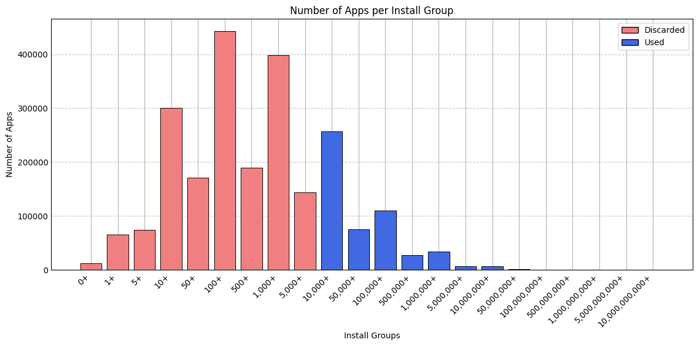
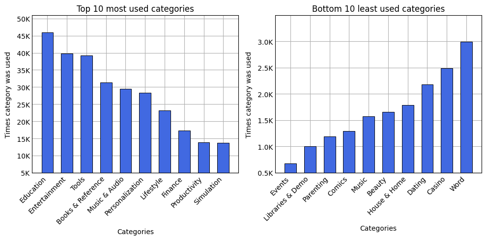
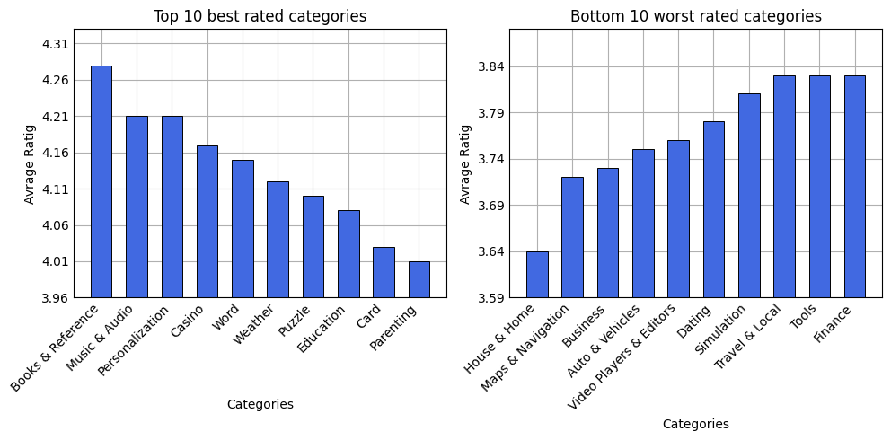
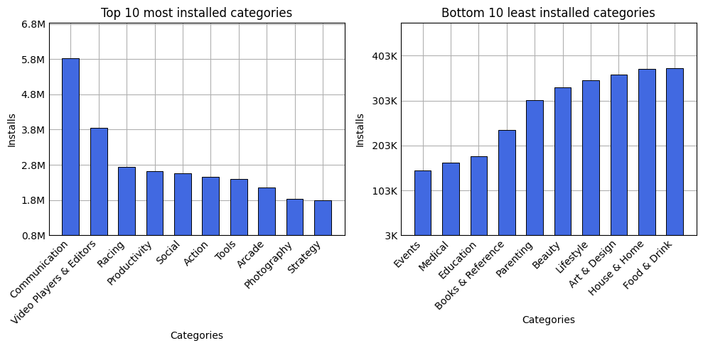
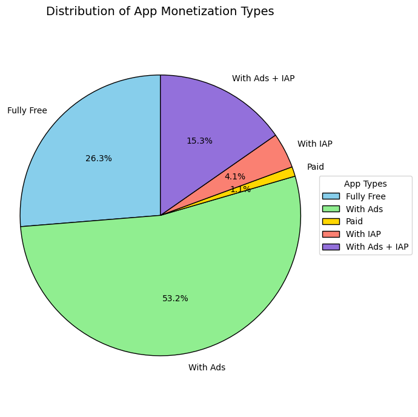
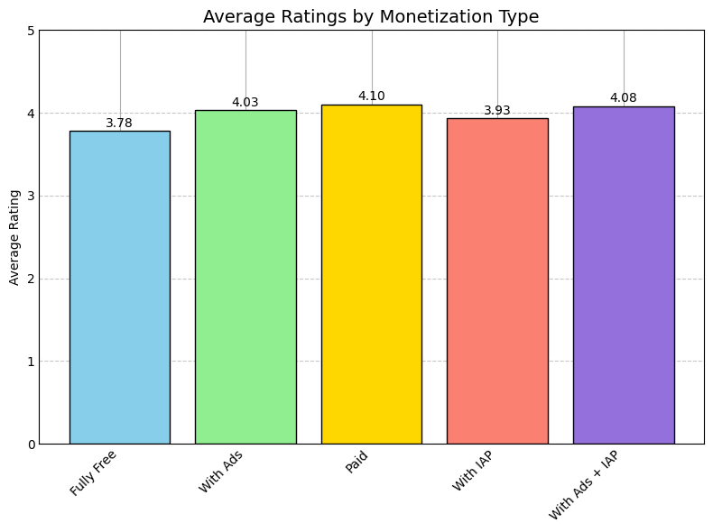

## Analiza aplikacij Google Play Store
### Vmesno poročilo

| Člani skupine |
|:---|
|Lan Miglič|
|Klemen Krkovič|
|Filip Vrabec|

### Opis problema
Analizirali bomo podatke o aplikacijah z trgovine Google Play Store. Podatki so pridobljeni s spletne strani [kaggle](https://www.kaggle.com/datasets/gauthamp10/google-playstore-apps?resource=download). Od prve izbire problema smo našli novejši nabor podatkov, in sicer iz leta 2021 (prvi je bil nazadnje posodobljen leta 2019). Ta nabor je tudi veliko večji, vsebuje podatke o 2,3 miljonih aplikacij. 
Ker je tudi ta nabor dokaj star bomo v prihodnosti najverjetneje z id-ji aplikacij pridobili trenutne podatke.


### Opis podatkov
**ATRIBUTI:**

* `App Name` - Ime aplikacije, kot je prikazano v trgovini (*string*)  
* `App Id` - Enolični identifikator aplikacije v trgovini Google Play (*string*)  
* `Category` - Kategorija, kateri aplikacija pripada, npr. "Tools", "Games", ipd. (*string*)  
* `Rating` - Povprečna ocena uporabnikov (*float*)  
* `Rating Count` - Skupno število uporabniških ocen (*int*)  
* `Installs` - Ocena skupnega števila prenosov aplikacije (*int*)  
* `Minimum Installs` - Najmanjše ocenjevano število prenosov (*int*)  
* `Maximum Installs` - Največje ocenjevano število prenosov (*int*)  
* `Free` - Ali je aplikacija brezplačna (*boolean*)  
* `Price` - Cena aplikacije v navedeni valuti, če ni brezplačna (*float*)  
* `Currency` - Valuta, v kateri je določena cena (*string*, npr. "USD", "EUR")  
* `Size` - Velikost aplikacije – v bajtih, MB, ali kot oznaka "Varies with device" (*string*)  
* `Minimum Android` - Najnižja podprta različica Android operacijskega sistema (*string*)  
* `Developer Id` - Unikatna oznaka razvijalca v sistemu Google Play (*string*)  
* `Developer Website` - Povezava do uradne spletne strani razvijalca (*string*)  
* `Developer Email` - Kontaktni e-poštni naslov razvijalca (*string*)  
* `Released` - Datum prve objave aplikacije v trgovini (*string*)  
* `Privacy Policy` - Povezava do politike zasebnosti aplikacije (*string*)  
* `Last Updated` - Datum zadnje posodobitve aplikacije (*string*)  
* `Content Rating` - Priporočena starostna skupina za uporabnike (*enum* { Everyone | Teen | Mature | Adults Only })  
* `Ad Supported` - Ali aplikacija prikazuje oglase (*boolean*)  
* `In App Purchases` - Ali aplikacija omogoča nakupe znotraj aplikacije (*boolean*)  
* `Editor's Choice` - Ali je aplikacija označena kot “Editor's Choice” (*boolean*)


### Priprava podatkov
Ob hitrem pregledu podatkov smo opazili, da je veliko število aplikacij zelo "nepopularnih" (imajo relativno malo namestitev). Odločili smo se, da aplikacij z manj kot 10.000 namestitvami ne bomo obravnavali. Tako nam je ostalo še 517.325 aplikacij.



### Prva opažanja 

Prva stvar, ki smo jo želeli pogledati je, katere kategorije vsebujejo največ aplikacij, imajo najboljše povprečne ocene in največkrat nameščene aplikacije.

```python
category_counts = store['Category'].value_counts()
category_MinInstall_all = (
    store[(store['Minimum Installs'].notna())]
    .groupby('Category')['Minimum Installs']
    .apply(list)
    .to_dict()
)
category_MaxInstall_all = (
    store[(store['Maximum Installs'].notna())]
    .groupby('Category')['Maximum Installs']
    .apply(list)
    .to_dict()
)
category_Rating = (
    store[(store['Rating'].notna()) & (store['Rating'] != 0.0)]
    .groupby('Category')['Rating']
    .apply(list)
    .to_dict()
)
rating_price = store[(store['Rating'].notna()) & (store['Rating'] != 0.0)].groupby('Free')['Rating'].apply(list)
category_Install_mid = []
for key in category_MinInstall_all:
    value = ((sum(category_MinInstall_all[key]) + sum(category_MaxInstall_all[key])) / 2) / category_counts[key]
    category_Install_mid.append((key, round(value)))

category_Install_mid = sorted(category_Install_mid, key=lambda x: x[1], reverse=True)

category_avg_rating = []
for key in category_Rating:
    category_avg_rating.append((key, round(sum(category_Rating[key]) / len(category_Rating[key]), 2)))
  
category_avg_rating = sorted(category_avg_rating, key=lambda x: x[1], reverse=True)

install_counts = store['Installs'].value_counts()
install_counts_list = list(install_counts.items())
install_counts_list.sort(key=lambda x: int(x[0].replace(',', '').replace('+', '')))

filtered = store[(store['Rating'].notna()) & (store['Rating'] != 0.0)]

is_paid = ~filtered['Free']
has_ads = filtered['Ad Supported'] == True
has_iap = filtered['In App Purchases'] == True
fully_free = filtered['Free'] & ~has_ads & ~has_iap
with_ads = filtered['Free'] & has_ads & ~has_iap
with_iap = filtered['Free'] & ~has_ads & has_iap
with_both = filtered['Free'] & has_ads & has_iap

rating_price = {
    'Fully Free': filtered[fully_free]['Rating'].tolist(),
    'With Ads': filtered[with_ads]['Rating'].tolist(),
    'Paid': filtered[is_paid]['Rating'].tolist(),
    'With IAP': filtered[with_iap]['Rating'].tolist(),
    'With Ads + IAP': filtered[with_both]['Rating'].tolist()
    
}
```

Ker je kategorij 48 smo prikazali top 10 najbolj/najmanj pomembnih kategorij. Potrebno je upoštevati tudi, da videoigre nimajo svoje kategorije, vendar so razdeljene med drugimi kot so racing, puzzles in podobne. 





Ena zanimivost razvidna izmed teh grafov je, da je v kategoriji Education največ aplikacij, vendar je ta kategorija 3. najnižja po povprečnih namestitvah. Books & Reference je v podobni situaciji.

### Plačljivost

Še ena stvar ki smo jo pogledali so monetizacijski modeli aplikacij. Več kot polovica aplikacij služi z oglasi, več kot četrtina pa je popolnoma brezplačna brez oglasov. Okoli 1 odstotek je plačljivih aplikacij.



Po spodnjem grafu pa je razvidno da različni načini služenja ne vplivajo pretirano na ocene uporabnikov.



### Za prihodnost
Najverjetneje bomo sami zbrali bolj aktualne podatke.
Poleg tega bomo analizirali bolj specifične atribute glede kategorij. Pogledali bomo cene aplikacij, kateri razvijalci so najbolj popularni in kako služijo.
Pogledali bomo tudi kako starostne omejitve vplivajo na popularnost aplikacije.

Naredili bomo cenovne skupine, da se vidi in what price range from-to most paid apps are.
We are going to check if some groups have statistical anomalies that mess up the avrage.
pogledali bomo v katere kategorije spadajo popularne aplikacije in kdo jih je naredil.
Ustvarili bomo cenovne razrede, da bomo videli, v katerem cenovnem območju (od–do) se nahaja največ plačljivih aplikacij.
Preverili bomo tudi, ali določene skupine vsebujejo statistične anomalije, ki izkrivljajo povprečje.
Pogledali bomo, v katere kategorije sodijo priljubljene aplikacije in kdo jih je razvil.


